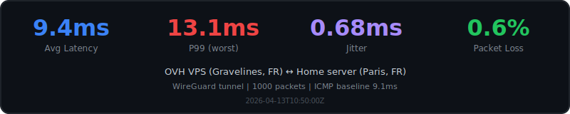
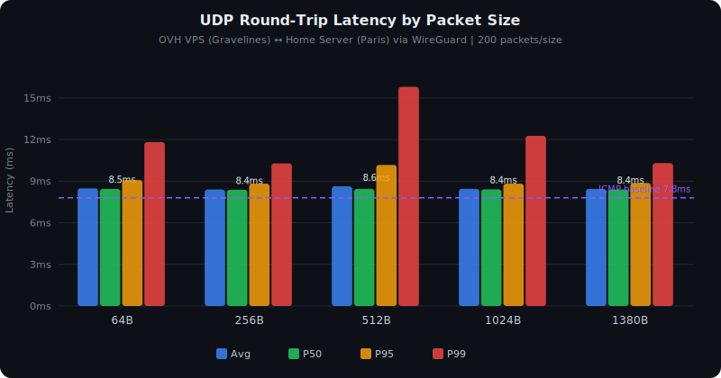
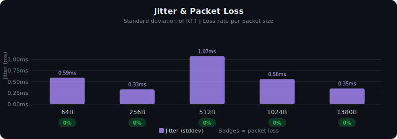

# GameTunnel

Self-hosted game server tunneling with transparent source IP preservation.

Expose home game servers through a public VPS. Players connect to the VPS, traffic is tunneled to your home server, and the game server sees the player's real IP. No game server mods, no client plugins.

```
Player (real IP: 1.2.3.4)
    → VPS:25565 (public)
    → iptables MARK → policy routing → GRE tunnel → WireGuard
    → Home game server sees: 1.2.3.4
```

## Quick Start

### 1. VPS Setup

```bash
# Install
go install github.com/Sergentval/gametunnel/cmd/gametunnel@latest

# Initialize (auto-generates WireGuard keys, detects public IP)
sudo gametunnel server init --public-ip $(curl -4s ifconfig.me)

# Create a join token for your home server
sudo gametunnel server token create home-server

# Start the server
sudo PUBLIC_IP=$(curl -4s ifconfig.me) gametunnel server run
```

### 2. Home Server Setup

```bash
# Install
go install github.com/Sergentval/gametunnel/cmd/gametunnel@latest

# Join using the token from step 1
sudo gametunnel agent join gt_eyJ1IjoiaH...

# Start the agent
sudo gametunnel agent run
```

### 3. Done

Players connect to `YOUR_VPS_IP:25565`. The game server sees their real IP.

## Systemd Services

### Server (VPS)

```ini
# /etc/systemd/system/gametunnel-server.service
[Unit]
Description=GameTunnel Server
After=network-online.target docker.service
Wants=network-online.target

[Service]
Type=simple
Environment=PUBLIC_IP=YOUR_VPS_IP
ExecStart=/usr/local/bin/gametunnel server run --config /etc/gametunnel/server.yaml
ExecStopPost=-/usr/sbin/ip link del wg-gt
Restart=on-failure
RestartSec=5

[Install]
WantedBy=multi-user.target
```

### Agent (Home)

```ini
# /etc/systemd/system/gametunnel-agent.service
[Unit]
Description=GameTunnel Agent
After=network-online.target docker.service
Wants=network-online.target

[Service]
Type=simple
ExecStart=/usr/local/bin/gametunnel agent run --config /etc/gametunnel/agent.yaml
ExecStopPost=-/usr/sbin/ip link del wg0
Restart=on-failure
RestartSec=5

[Install]
WantedBy=multi-user.target
```

## Pelican Panel Integration

Auto-create tunnels from Pelican Panel allocations:

```bash
sudo gametunnel server init \
  --pelican-url https://panel.example.com \
  --pelican-key ptla_YOUR_KEY \
  --pelican-node 3 \
  --public-ip YOUR_VPS_IP
```

The Pelican watcher polls the Panel API every 30 seconds. Tunnels are created when allocations are assigned to servers and removed when unassigned.

### Pelican API Key Setup

Create an Application API key in Pelican with `node`, `allocation`, and `server` READ permissions. The key format is `papp_` followed by 48+ random characters.

### Wings Configuration

When using GameTunnel, configure Wings on the home server to listen on the WireGuard IP:

```yaml
# /etc/pelican/config.yml
api:
  host: 10.99.0.2    # WireGuard IP (not Tailscale or LAN IP)
  port: 8443          # Different port from VPS Wings (8080)
  ssl:
    enabled: false    # WireGuard provides encryption
```

Update the Panel node configuration:
- **FQDN**: Public hostname proxied to Wings (e.g., `wings-home.example.com`)
- **Scheme**: `https` (via reverse proxy)
- **Daemon port**: `443` (reverse proxy port)
- **Allocations**: Use the WireGuard IP (e.g., `10.99.0.2`)

### Reverse Proxy for Wings

The Panel frontend (browser) needs to reach Wings for WebSocket connections. Since Wings listens on a private WireGuard IP, set up a reverse proxy (Traefik, nginx, etc.):

```yaml
# Traefik dynamic config example
http:
  routers:
    wings-home:
      rule: "Host(`wings-home.example.com`)"
      service: wings-home
  services:
    wings-home:
      loadBalancer:
        servers:
          - url: "http://10.99.0.2:8443"
```

## Features

- **Source IP preservation** — game servers see real player IPs (TCP + UDP)
- **Kernel-level forwarding** — zero-copy packet path via iptables MARK + policy routing (TCP + UDP)
- **One-command setup** — `server init` + `agent join <token>`
- **Pelican Panel integration** — auto-tunnel from server allocations
- **Single binary** — `gametunnel` does everything
- **Auto-reconnect** — agent recovers from VPS restarts
- **Docker container auto-detection** — agent finds container bridge IPs via Docker inspect

## Benchmarks

Real-world latency measurements between an OVH VPS (Gravelines, FR) and a home server (Paris, FR) through the WireGuard tunnel.







<details>
<summary>Raw results</summary>

| Size | Sent | Lost | Min | Avg | P50 | P95 | P99 | Max | Jitter |
|------|------|------|-----|-----|-----|-----|-----|-----|--------|
| 64B | 100 | 0 | 6.83ms | 8.07ms | 7.96ms | 9.88ms | 12.37ms | 12.37ms | 0.81ms |
| 256B | 100 | 0 | 6.93ms | 8.02ms | 8.05ms | 8.84ms | 9.79ms | 9.79ms | 0.50ms |
| 512B | 100 | 0 | 7.08ms | 8.08ms | 8.03ms | 8.73ms | 11.63ms | 11.63ms | 0.69ms |
| 1024B | 100 | 0 | 7.02ms | 8.02ms | 7.96ms | 8.70ms | 11.64ms | 11.64ms | 0.61ms |
| 1380B | 100 | 0 | 7.11ms | 8.08ms | 8.11ms | 8.71ms | 10.11ms | 10.11ms | 0.47ms |

Run your own: `gametunnel bench server` on one end, `gametunnel bench client --target <IP>:9999` on the other.

</details>

## How It Works

### VPS (Server)

1. **iptables MARK** — incoming game packets (TCP + UDP) are marked with fwmark `0x1` in the mangle PREROUTING chain
2. **Policy routing** — marked packets are routed via a dedicated table through the GRE interface instead of being delivered locally
3. **Local table reordering** — the kernel's local routing table is moved to a lower priority so marked packets hit the fwmark rule first
4. **GRE encapsulation** — packets enter the GRE tunnel with original source/destination IPs preserved
5. **GRE mark clearing** — fwmark is cleared on GRE outer packets (mangle OUTPUT) to prevent a routing loop
6. **WireGuard encryption** — GRE-encapsulated packets are encrypted and sent to the home server

### Home (Agent)

1. **GRE decapsulation** — packets arrive via WireGuard, GRE unwraps them with original player IPs intact
2. **DNAT** — destination is rewritten from the VPS public IP to the Docker container's bridge IP (auto-detected via `docker inspect`)
3. **Connmark routing** — incoming GRE connections are tagged with connmark `0x2`; reply packets from the container have the mark restored and are routed back through GRE (only game replies, not DNS/downloads)
4. **POSTROUTING skip** — a RETURN rule prevents Docker's MASQUERADE from rewriting the source IP on GRE-bound replies

### Kernel Requirements

```bash
# Required modules (usually auto-loaded)
modprobe ip_gre        # GRE (only needed if using legacy GRE backend)
modprobe xt_TPROXY     # TPROXY (only for iptables fallback)
modprobe tcp_bbr       # BBR congestion control (recommended)

# Required sysctls (forwarding + accept_local for tunnel routing)
sysctl -w net.ipv4.ip_forward=1
sysctl -w net.ipv4.conf.all.rp_filter=0
sysctl -w net.ipv4.conf.all.accept_local=1
```

### Recommended Network Tuning

Apply on **both** VPS and home agent for full-throughput downloads through
the tunnel (Steam updates, game asset downloads). Without this, single TCP
connections through the tunnel can be capped at <2 MB/s by CUBIC's slow-start.

```bash
sudo cp deploy/sysctl/99-gametunnel.conf /etc/sysctl.d/
echo "tcp_bbr" | sudo tee /etc/modules-load.d/bbr.conf
sudo modprobe tcp_bbr
sudo sysctl -p /etc/sysctl.d/99-gametunnel.conf
```

This enables BBR + fq qdisc + 64 MB TCP buffers + TCP Fast Open. Observed
improvement on a 1 Gbps fibre link: Steam CDN download speed jumped from
1.86 MB/s to 47+ MB/s (~25× faster).

## Configuration Reference

### Server (`server.yaml`)

```yaml
server:
  api_listen: "0.0.0.0:8090"
  state_file: "/var/lib/gametunnel/state.json"

agents:
  - id: "home-server"
    token: "generated-by-token-create"

wireguard:
  interface: "wg-gt"
  listen_port: 51820
  private_key: "base64-key"
  subnet: "10.99.0.0/24"

tproxy:
  mark: "0x1"
  routing_table: 100

pelican:
  enabled: true
  panel_url: "http://172.16.0.3"     # Docker internal IP (bypasses auth proxy)
  api_key: "papp_..."
  node_id: 3
  default_agent_id: "home-server"
  sync_mode: "polling"
  poll_interval_seconds: 30
  default_protocol: "tcp"
  port_protocols:
    25565: "tcp"
    19132: "udp"
```

### Agent (`agent.yaml`)

```yaml
agent:
  id: "home-server"
  server_url: "http://51.178.25.173:8090"
  token: "matching-server-token"
  heartbeat_interval_seconds: 10

wireguard:
  interface: "wg0"
  private_key: "base64-key"
  server_endpoint: "51.178.25.173:51820"

routing:
  return_table: 200
  docker_bridge: "pelican0"           # Docker bridge for connmark restore
```

## Architecture

See [design spec](docs/superpowers/specs/2026-04-12-gametunnel-design.md) for full technical details.

## License

MIT
